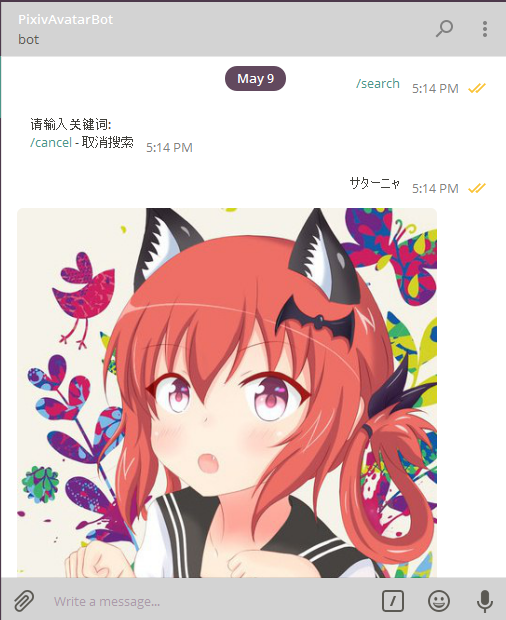

# PixivAvatarBot

*A Telegram Bot to get avatar from Pixiv.*    
*从p站找头像的Telegram机器人*

## 使用

在Telegram中打开[@PixivAvatarBot](https://telegram.me/PixivAvatarBot)，开始对话

**例子：**

目前放在AWS上，不保证随时可用  
想自己运行的话，在token.conf.example中补全token，重命名为token.conf，运行run.sh

## 实现

- Bot框架： python-telegram-bot
- 头像检测：lbpcascade_animeface + OpenCV + Pillow
- Pixiv操作：pixivpy
- 日榜缓存：redis

## 感谢
针对`get_illust_from_ranking`中“更新日榜信息+处理图片”二次等待造成的性能问题，[geoffreyQiu](https://github.com/geoffreyQiu)提供了关键词优先的解决思路，~~虽然我还没有实现~~

*Have fun!*
